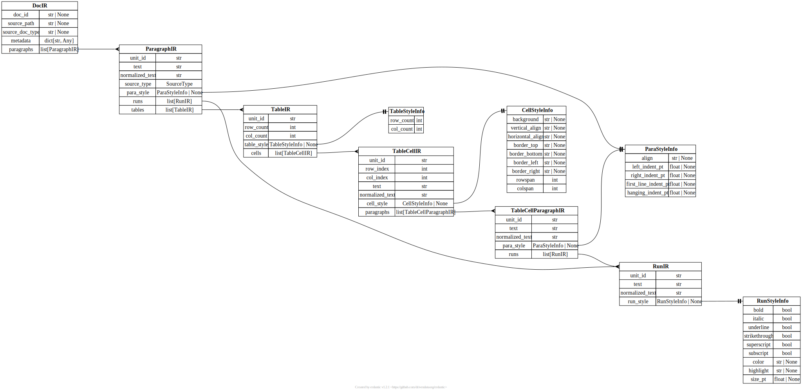

# document-processor

Batteries-included structural document IR parser for `hwp`, `hwpx`, and `docx`.
Provides a unified Pydantic-based data model for document structure, styles, and
content, along with APIs for parsing, editing, annotation, and HTML export.

**Requires Python 3.13+**

Additional docs:

- [Usage Guide](docs/usage-guide.md)
- [API Reference](docs/api-reference.md)

## Installation

```bash
pip install document-processor
```

Local development:

```bash
uv pip install -e /path/to/document-processor
```

### Dependencies

| Package | Purpose |
|---|---|
| `pydantic` | IR models and validation |
| `python-docx` | DOCX parsing and native write-back |
| `jpype1` | HWP conversion via Java interop |


## Quick start

```python
from document_processor import DocIR

doc = DocIR.from_file("/path/to/file.docx")

print(doc.paragraphs[0].text)
print(doc.paragraphs[0].runs[0].run_style.bold)

html = doc.to_html(title="Preview")
```

The package covers:

- document parsing (DOCX, HWPX, HWP)
- style extraction (fonts, colors, alignment, spacing, borders, ...)
- structural IR creation
- embedded image extraction for `docx` and `hwpx`
- stateless text editing with native file write-back
- annotation resolution and review HTML rendering


## Custom metadata

All IR models include a `.meta` field for attaching processing metadata
(e.g. for LLMs, RAG, analysis).

```python
for file_ in files:
    doc = DocIR.from_file(file_)

    class MyMetaData(BaseModel):
        a: int = 1
        b: str = "test"

    metainfo = MyMetaData(a=2)
    doc.paragraphs[0].runs[0].meta = metainfo

    with \
        open((out_dir / file_.stem).with_suffix(".json"), "w", encoding="utf-8") as json_f, \
        open((out_dir / file_.stem).with_suffix(".html"), "w", encoding="utf-8") as html_f:
        
        json.dump(doc.model_dump(mode="json"), json_f, indent=4, ensure_ascii=False)
        html_f.write(doc.to_html())

    print(f"completed: {file_}")
```

> **Note:** Metadata objects must extend Pydantic `BaseModel`. Otherwise a validation error is raised.


## Images in the IR

Parsed image binaries are stored once on `DocIR.assets`, and paragraph-like nodes keep ordered
`content` entries so text, tables, and images can be rendered in source order.

```python
from document_processor import DocIR

doc = DocIR.from_file("/path/to/file.docx")
first_asset = next(iter(doc.assets.values()))
html = doc.to_html()
```


## Editing documents

The stateless edit API lets you apply text edits to documents. Edits are
validated before application, and results can be returned as an updated `DocIR`,
written back to the native file format, or returned as bytes.

```python
from document_processor import (
    apply_text_edits,
    ApplyTextEditsRequest,
    DocumentInput,
    TextEdit,
)

result = apply_text_edits(ApplyTextEditsRequest(
    document=DocumentInput(source_path="/path/to/file.docx"),
    edits=[TextEdit(
        target_kind="paragraph",
        target_unit_id="s1.p3",
        expected_text="old text",
        new_text="new text",
    )],
))
```

Related helpers:

- `get_document_context()` &mdash; fetch surrounding paragraphs for target IDs
- `list_editable_targets()` &mdash; enumerate safe paragraph, run, and cell edit targets
- `validate_text_edits()` &mdash; dry-run validation without applying


## Annotations and review HTML

Resolve text annotations against a document and render a highlighted review page:

```python
from document_processor import (
    render_review_html,
    RenderReviewHtmlRequest,
    DocumentInput,
    TextAnnotation,
)

result = render_review_html(RenderReviewHtmlRequest(
    document=DocumentInput(source_path="/path/to/file.docx"),
    annotations=[TextAnnotation(
        target_kind="paragraph",
        target_unit_id="s1.p3",
        selected_text="some phrase",
        label="Needs revision",
    )],
))

html = result.html
```


## Exporting HTML

Render a parsed document to styled HTML:

```python
from document_processor import DocIR

doc = DocIR.from_file("/path/to/file.docx")
html = doc.to_html(title="Preview")
debug_html = doc.to_html(title="Layout Debug", debug_layout=True)
```

The debug layout view outlines pages, tables, cells, and paragraphs, and labels
declared point dimensions next to browser-rendered sizes. HTML rendering clamps
negative paragraph indents so text stays inside the page or table-cell content
edge. Source cell margins are available on `CellStyleInfo.padding_*_pt` and are
rendered as table-cell padding.


## Visualizing the models

Install the visualization extra first:

```bash
pip install "document-processor[viz]"

# might need compiler flags depending on version, might error out
CFLAGS="-Wno-error=incompatible-pointer-types" ... install
```

Erdantic also needs Graphviz available on the system.

Render the default `DocIR` model diagram:

```bash
document-processor-diagram --out docir.svg
```

Render a package-scope diagram with IR fields/methods plus the main `core/`
modules:

```bash
document-processor-diagram --kind package --out package.svg
```

Render a custom model by dotted import path:

```bash
document-processor-diagram --model document_processor.DocIR --out docir.png
```

Or use the Python helper:

```python
from document_processor import draw_model_diagram

draw_model_diagram(out="docir.svg")
```

---

ERD for the pydantic models


